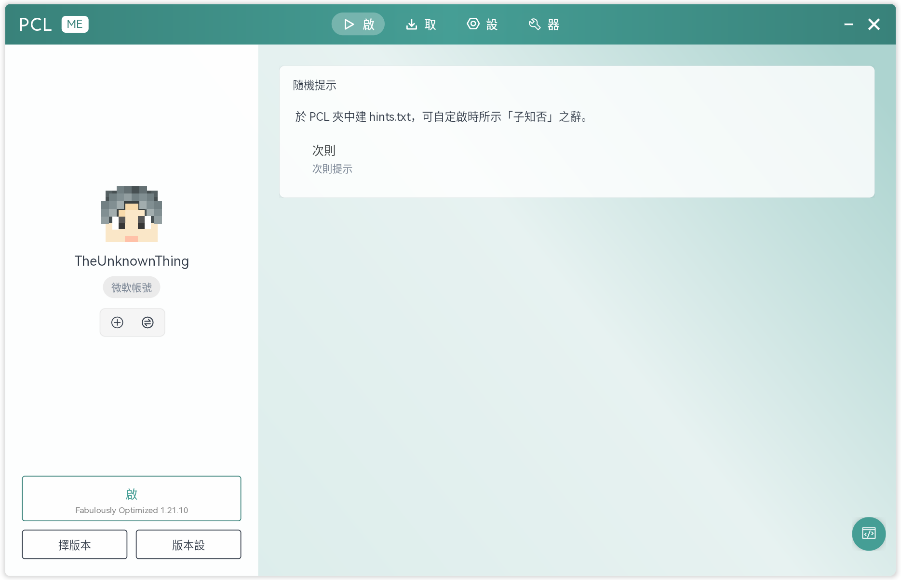
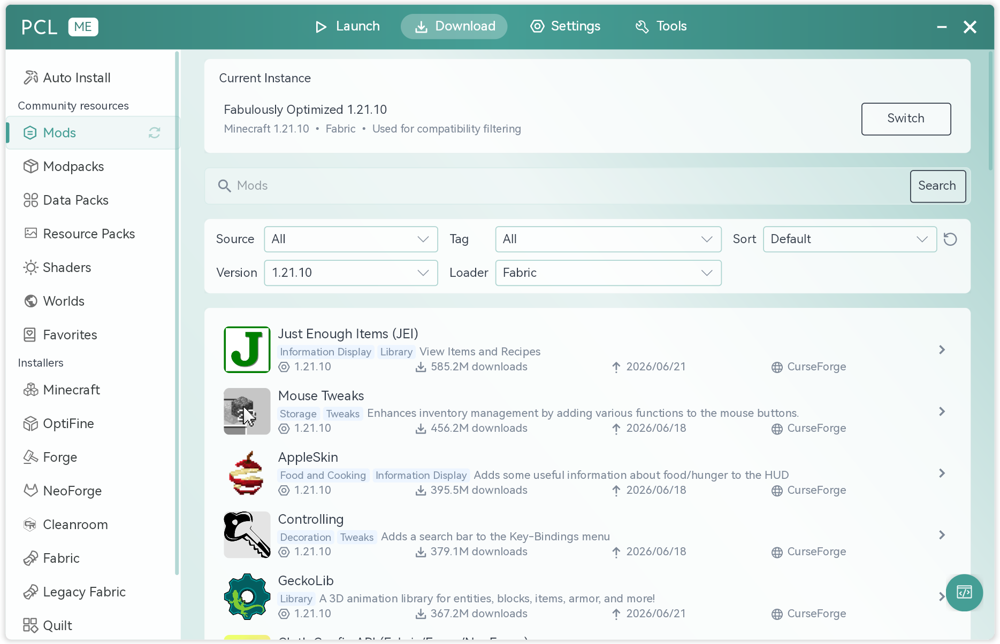
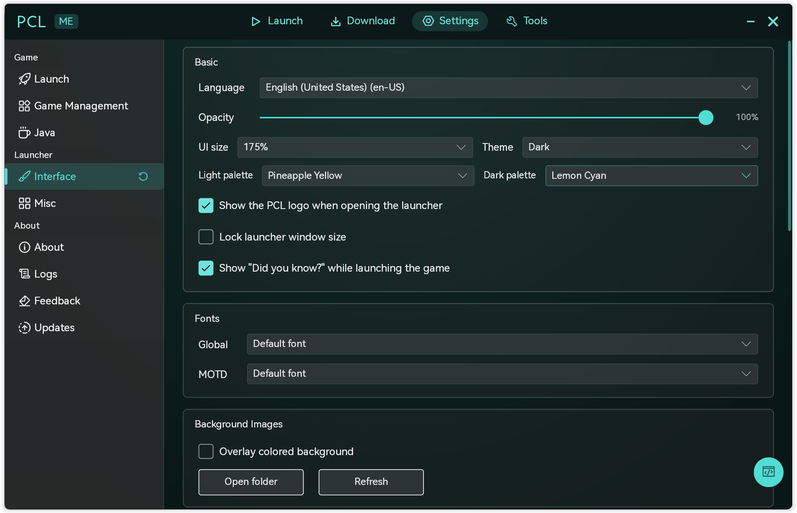

**简体中文** | [English](README-EN.md) | [繁體中文](README-ZH_TW.md)

<div align="center">


# PCL Multiplatform Edition

一款跨平台的 Minecraft 启动器，支持 Windows、macOS 和 Linux。

[⬇ 下载最新版本](https://github.com/TheUnknownThing/PCL-ME/releases/latest) ·
[🐛 反馈问题](https://github.com/TheUnknownThing/PCL-ME/issues) ·
[📖 贡献指南](CONTRIBUTING.md)

</div>

## 关于 PCL-ME

PCL-ME 致力于将 PCL 熟悉的使用体验完整带到 Windows、macOS 与 Linux 上，并长期维护下去。

## 界面预览

<table>
<tr>
<td></td>
<td></td>
<td></td>
</tr>
<tr>
<td align="center">启动游戏</td>
<td align="center">下载 Mod 与整合包</td>
<td align="center">界面与主题设置</td>
</tr>
</table>

## 平台支持

| 平台 | 状态 |
|---|---|
| 🐧 Linux | 主力平台，持续开发与测试 |
| 🍎 macOS | 主力平台，持续开发与测试 |
| 🪟 Windows | 已支持，但测试覆盖略少于上述平台 |

## 安装

- **Windows / macOS**：前往 [Releases 页面](https://github.com/TheUnknownThing/PCL-ME/releases/latest) 下载对应平台的安装包。
- **Linux**：除了 Releases 中的发行包，Arch Linux 用户也可以通过 AUR 安装：

  ```bash
  yay -S pcl-me-bin
  ```

---

## 给开发者

如果你希望从源码构建或参与开发：

```bash
dotnet restore
dotnet build
dotnet run --project PCL.Frontend.Avalonia/PCL.Frontend.Avalonia.csproj -- app
```

更多细节请参见 [Avalonia 前端文档](PCL.Frontend.Avalonia/README.md) 与 [后端文档](PCL.Core.Backend/README.md)，贡献流程请参见 [CONTRIBUTING.md](CONTRIBUTING.md)。

> PCL-ME 由 [PCL-CE](https://github.com/PCL-Community/PCL-CE) 分叉而来，目前作为独立分支维护。技术栈：C# + .NET 10 + Avalonia。

## 许可证

PCL-ME 的代码按目录分别授权：

- `PCL.Frontend.Avalonia/` 下的界面相关内容遵循 [自定义许可证](PCL.Frontend.Avalonia/LICENSE)。
- 仓库其余部分遵循 [Apache License 2.0](LICENSE)。

若不确定某个文件适用哪套条款，请查阅其所在目录或上级目录中的许可证说明。

#### 资源致谢

- 应用图标取自 [PCL-Community/PCL-CE-Logo](https://github.com/PCL-Community/PCL-CE-Logo)（Apache 2.0）。
- 界面字体使用 [HarmonyOS Sans](https://developer.huawei.com/consumer/en/design/resource/)，版权归 Huawei Device Co., Ltd. 所有，依据 HarmonyOS Sans Fonts License Agreement 授权使用，特此致谢。
