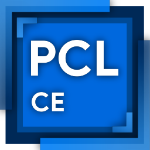

[簡體中文](README.md) | [English](README-EN.md) | **繁體中文**

<div align="center">



# PCL-ME

Plain Craft Launcher Multiplatform Edition

[下載發行版](https://github.com/TheUnknownThing/PCL-ME/releases/latest) |
[提交問題](https://github.com/TheUnknownThing/PCL-ME/issues) |
[貢獻指南](CONTRIBUTING.md) |
[Avalonia 前端文件](PCL.Frontend.Avalonia/README.md) |
[後端文件](PCL.Core.Backend/README.md)

</div>

PCL-ME 是上游社群版的硬分叉版本，現在的目標是維護一套可持續演進的跨平台啟動器程式碼棧。現行主線實作基於 C#、.NET 10 與 Avalonia，面向 Windows、macOS 與 Linux。

## 專案結構

- `PCL.Frontend.Avalonia/`：目前維護中的桌面前端與 UI 資源
- `PCL.Core.Backend/`：共用啟動器邏輯、後端工作流與基礎服務
- `PCL.Core.Backend.Test/`：後端回歸測試
- `PCL.Core.Backend.Foundation.Test/`：可攜性與基礎層測試

## 快速開始

```bash
dotnet restore
dotnet build
dotnet run --project PCL.Frontend.Avalonia/PCL.Frontend.Avalonia.csproj -- app
```

## 平台說明

| 平台 | 狀態 | 說明 |
|---|---|---|
| Windows | 持續完善中 | 已支援，但驗證強度仍低於 macOS / Linux |
| macOS | 主要目標平台 | 持續開發與測試 |
| Linux | 主要目標平台 | 持續開發與測試 |

## 授權條款

PCL-ME 採用分層授權模型：

- `PCL.Frontend.Avalonia/` 下的 UI 內容遵循 [PCL.Frontend.Avalonia/LICENSE](PCL.Frontend.Avalonia/LICENSE) 自訂授權。
- 本倉庫中其餘啟動器相關邏輯遵循 [Apache License 2.0](LICENSE)，除非某個檔案或子目錄另有說明。

如果你不確定某個檔案適用哪套條款，請先看它所在目錄，再檢查該目錄附近的授權說明。
