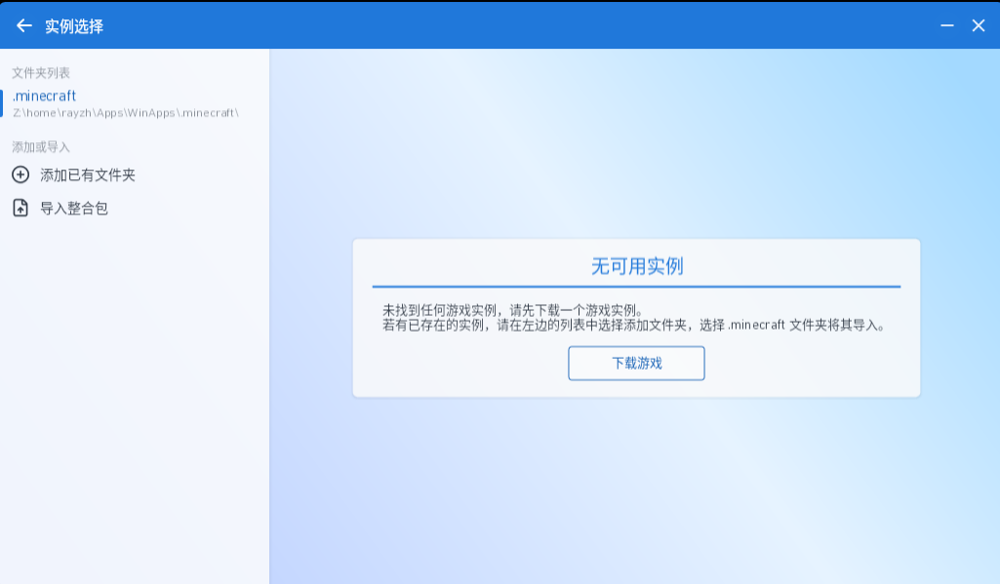
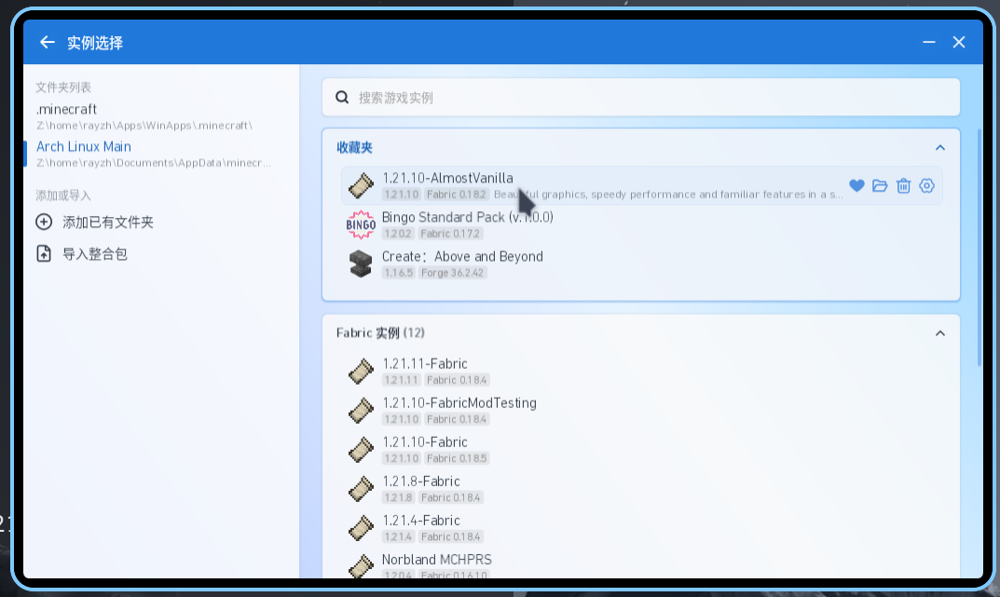
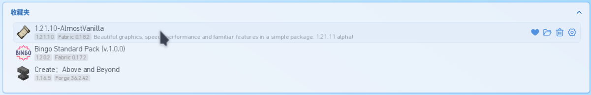

# UI Observations

## Title Bar

Defined primarily in `PCL.Frontend.Spike/Desktop/MainWindow.axaml`

[x] When toggling modes, the white backdrop should fade in instead of popping in without animation. 
[x] Remove the "Maximize" button from the title bar. 
[x] In context mode (indicating the window displays a specific information), the PCL CE logos and all other LFS components should be hidden, leaving only the text for the context. See image: 

[x] In context mode, pressing `ESC` cannot return to the page before the current context. 

## Instance Selection

Have not been implemented yet, see image for reference: 

[x] Empty minecraft dir should provide a dialog telling user about the current state, see image 1. 
[x] Filled minecraft dir should provide a list of instances, see image 2. 
[ ] Currently "添加已有文件夹" will replace the folder instead of appending to list of folders to look for instances. 
[ ] Text of selected folder should always be blue, but instead it needs to be hovered before it turns blue (and removing the mouse thereafter does not turn it to black). Similar issue observed for the "我清楚我在做什么" button shown when launching the debug version of PCL. They may be connected, and there may be other places where this issue is present. 
[ ] On the right side, instances should be displayed in a list (like mods in 下载 page), each having a full-length (currently wrapped to text) light blue highlight on hover, see image: 

